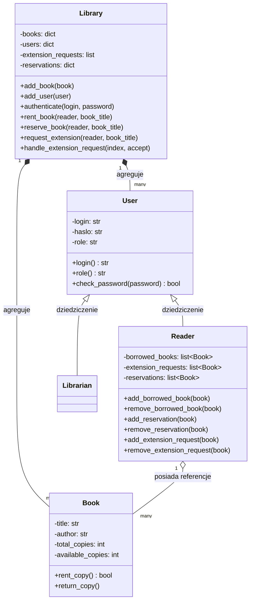

# Opis Struktury Obiektowej Projektu Biblioteki
## Przewodnik po Architekturze i Klasach (Wersja Hybrydowa OOP/FP)

Ten dokument opisuje architekturę obiektową systemu bibliotecznego zaimplementowanego w pliku [library.py](file:///c:/Users/Amelka%20i%20Zuzia/Desktop/BigData/big-data-library-functional/library.py). Wyjaśnia strukturę klas, ich odpowiedzialności, wzajemne powiązania oraz ogólny przepływ działania aplikacji. Pomaga zrozumieć, jak system jest zbudowany od strony **Programowania Obiektowego (OOP)**.

---

## 1. Ogólny Schemat Architektury

Aplikacja opiera się na klasach reprezentujących obiekty domeny (Książka, Użytkownik, Czytelnik, Bibliotekarz) oraz klasie zarządczej (`Library`), która działa jako fasada i kontener dla danych.

---

## 2. Szczegółowy Opis Klas

### A. Klasa `Book` (Książka)
Reprezentuje pojedynczy tytuł w bibliotece wraz z informacją o stanie magazynowym.
* **Atrybuty prywatne (enkapsulacja):**
  * `__title` (Tytuł)
  * `__author` (Autor)
  * `__total_copies` (Łączna liczba sztuk w bibliotece)
  * `__available_copies` (Liczba aktualnie dostępnych sztuk na półce)
* **Właściwości (Gettery/Settery):**
  * Właściwości `@property` umożliwiają bezpieczny odczyt parametrów książki z zewnątrz.
  * Setter `available_copies` pilnuje reguły biznesowej – liczba sztuk nie może spaść poniżej `0`.
* **Metody:**
  * `rent_copy()` – Zmniejsza liczbę dostępnych kopii o 1 (jeśli są dostępne) i zwraca `True` (sukces) lub `False` (brak sztuk).
  * `return_copy()` – Zwiększa liczbę dostępnych kopii o 1 (nie przekraczając stanu maksymalnego `total_copies`).

---

### B. Klasa `User` (Użytkownik - Klasa Bazowa)
Klasa bazowa dla wszystkich zalogowanych osób w systemie.
* **Atrybuty chronione:**
  * `_login` (Nazwa użytkownika)
  * `_haslo` (Hasło)
  * `_role` (Rola: `"czytelnik"` lub `"bibliotekarz"`)
* **Metody:**
  * `check_password(password)` – Porównuje podane hasło z zapisanym hasłem użytkownika (bezpieczna weryfikacja).

---

### C. Klasa `Reader` (Czytelnik - Dziedziczy po `User`)
Reprezentuje czytelnika biblioteki. Dziedziczy mechanizm logowania po klasie `User` i rozszerza go o specyficzne dla czytelnika kolekcje.
* **Specyficzne atrybuty:**
  * `__borrowed_books` – Lista aktualnie wypożyczonych obiektów klasy `Book`.
  * `__reservations` – Lista zarezerwowanych obiektów klasy `Book` (gdy stan wynosił 0).
  * `__extension_requests` – Lista książek, dla których czytelnik złożył prośbę o przedłużenie terminu zwrotu.
* **Metody:**
  * Metody typu `add_*` / `remove_*` służą do zarządzania stanem wypożyczeń, rezerwacji i próśb o przedłużenie dla konkretnego czytelnika.

---

### D. Klasa `Librarian` (Bibliotekarz - Dziedziczy po `User`)
Reprezentuje pracownika biblioteki posiadającego uprawnienia administracyjne.
* **Charakterystyka:** Nie przechowuje własnych wypożyczeń. Służy głównie jako znacznik roli (`role == "bibliotekarz"`), co pozwala systemowi na przekierowanie do panelu administracyjnego po zalogowaniu.

---

### E. Klasa `Library` (System Zarządzający - Biblioteka)
Najważniejsza klasa systemu, pełniąca rolę **kontrolera i kontenera danych**. Agreguje wszystkie obiekty książek i użytkowników oraz zarządza logiką procesów biznesowych.
* **Główne kolekcje:**
  * `__books` – Słownik mapujący tytuły na obiekty `Book`.
  * `__users` – Słownik mapujący loginy na obiekty `User` (zarówno `Reader`, jak i `Librarian`).
  * `__extension_requests` – Lista oczekujących próśb o przedłużenie terminu zwrotu w postaci słowników z referencjami: `{"reader": Reader, "book": Book}`.
  * `__reservations` – Słownik kolejki rezerwacji mapujący tytuł książki na listę czytelników czekających na dany tytuł.
* **Kluczowe procesy biznesowe:**
  * `rent_book()` – Rejestruje wypożyczenie: weryfikuje dostępność, zmniejsza stan książki, dodaje ją czytelnikowi i w razie potrzeby aktualizuje kolejki rezerwacji.
  * `reserve_book()` – Dodaje czytelnika do kolejki oczekujących na książkę o zerowym stanie magazynowym.
  * `request_extension()` / `handle_extension_request()` – Proces zgłaszania i akceptacji/odrzucenia prośby o przedłużenie terminu zwrotu przez bibliotekarza.
  * Metody statystyczne (`get_most_popular_book()`, `get_total_active_rentals()`, `get_readers_ranking()`) – wyliczają raporty przy użyciu funkcji wyższego rzędu i programowania funkcyjnego.

---

## 3. Przepływ Działania Aplikacji (Workflow)

1. **Uruchomienie (`main()`):**
   * Program inicjuje obiekt klasy `Library` bazowymi danymi (książki, czytelnicy, bibliotekarz).
   * Użytkownik ma maksymalnie 3 próby na zalogowanie się podając login i hasło.
   * `Library.authenticate()` wyszukuje użytkownika i sprawdza zgodność hasła.
2. **Rozróżnienie Ról:**
   * Za pomocą funkcji `isinstance(zalogowany_uzytkownik, Class)` system rozpoznaje klasę zalogowanego użytkownika:
     * Jeśli to `Reader` -> uruchamia `menu_czytelnika()`.
     * Jeśli to `Librarian` -> uruchamia `menu_bibliotekarza()`.
3. **Pętla Menu:**
   * Działa w nieskończonej pętli `while True` aż do momentu wybrania opcji "Wyloguj", która przerywa pętlę instrukcją `break`.

---

## 4. Przykładowe Pytania z OOP na Obronie (Q&A)

### Pytanie 1: Co to jest enkapsulacja (hermetyzacja) i jak została zaimplementowana w tym kodzie?
> **Odpowiedź:** Enkapsulacja to ukrywanie wewnętrznego stanu obiektu przed bezpośrednim dostępem z zewnątrz i udostępnianie go jedynie przez kontrolowany interfejs (metody i właściwości). W moim kodzie zaimplementowałem to poprzez użycie **podwójnego podkreślenia** przy nazwach atrybutów prywatnych (np. `self.__title`, `self.__available_copies` w klasie `Book`). Dostęp do nich odbywa się za pomocą dekoratorów `@property` (gettery) oraz setterów. Dzięki temu zewnętrzny kod nie może bezpośrednio zmienić np. liczby kopii na wartość ujemną, ponieważ chroni przed tym logika walidacji w setterze.

### Pytanie 2: Gdzie w kodzie występuje dziedziczenie i jaki problem ono rozwiązuje?
> **Odpowiedź:** Dziedziczenie występuje w klasach `Reader` oraz `Librarian`, które dziedziczą po klasie bazowej `User`. Rozwiązuje to problem powielania kodu (DRY - Don't Repeat Yourself). Klasa `User` definiuje wspólne cechy dla każdego użytkownika systemu, takie jak `login`, `haslo` i `role` oraz metodę weryfikacji hasła `check_password`. Klasy pochodne automatycznie to dziedziczą i mogą skupić się na dodawaniu specyficznych dla siebie cech (np. czytelnik dodaje listy wypożyczonych książek).

### Pytanie 3: Jak zrealizowano polimorfizm w menu głównym aplikacji?
> **Odpowiedź:** Polimorfizm w kodzie przejawia się podczas sprawdzania typu zalogowanego użytkownika za pomocą `isinstance()`. Choć metoda logowania zwraca ogólny obiekt klasy bazowej `User`, program potrafi dynamicznie rozpoznać, czy ma do czynienia ze specyficzną klasą `Reader` czy `Librarian` i na tej podstawie wywołać całkowicie inne menu z dopasowanym zestawem operacji.
