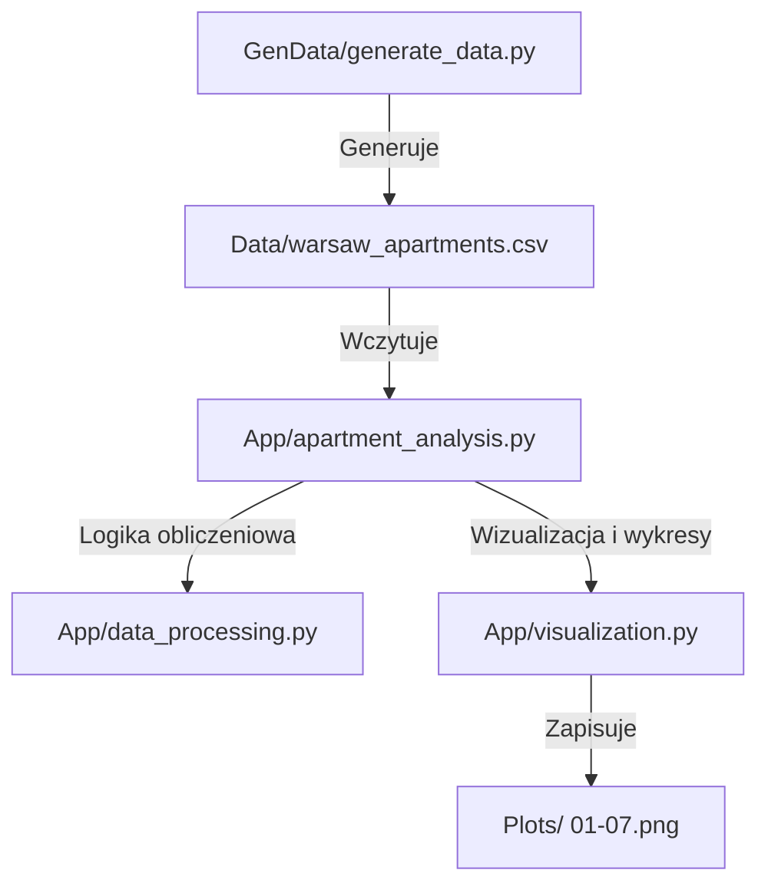

# Opis Struktury Projektu Analizy Danych
## Przewodnik po Architekturze Modułowej i Przepływie Danych (big-data-exercise3)

Ten dokument opisuje architekturę i przepływ przetwarzania danych w projekcie `big-data-exercise3` ([apartment_analysis.py](file:///c:/Users/Amelka%20i%20Zuzia/Desktop/BigData/big-data-exercise3/App/apartment_analysis.py)). Wyjaśnia podział odpowiedzialności między modułami, sposób generowania danych testowych oraz strukturę etapów analizy statystycznej.

---

## 1. Architektura Modułowa (Modular Architecture)

Projekt nie wykorzystuje klas obiektowych (OOP), lecz opiera się na **architekturze modułowej i funkcyjnej**, co jest standardem w inżynierii danych (Data Engineering). Kod jest podzielony na niezależne warstwy odpowiedzialności (Separation of Concerns):

### Opis Modułów:
1. **Generator Danych (`GenData/generate_data.py`):**
   * Skrypt odpowiedzialny za syntetyczne wygenerowanie realistycznego zbioru danych o mieszkaniach w Warszawie. 
   * Celowo wstrzykuje określone anomalie (outliery, błędne daty i ceny), aby umożliwić przetestowanie algorytmów czyszczenia.
2. **Silnik Przetwarzania (`App/data_processing.py`):**
   * Odpowiada za całą logikę matematyczną i statystyczną.
   * Zawiera funkcje wczytywania danych, liczenia statystyk opisowych (skośność, kurtoza), algorytmy detekcji outlierów (IQR, Z-score, Modified Z-score) oraz funkcję czyszczenia i transformacji danych.
3. **Moduł Wizualizacji (`App/visualization.py`):**
   * Odpowiada za generowanie wykresów przy użyciu bibliotek `matplotlib` oraz `seaborn`.
   * Konfiguruje wspólny styl wykresów (`setup_plotting_style`) i zapisuje wygenerowane analizy graficzne w folderze `Plots/`.
4. **Kontroler Główny (`App/apartment_analysis.py`):**
   * Plik uruchomieniowy orchestracji. Łączy funkcje obliczeniowe z wizualizacjami i steruje przebiegiem analizy krok po kroku (od części 1 do 7).

---

## 2. Etapy Przepływu Analizy (Pipeline)

Analiza w głównym skrypcie przebiega w 7 sekwencyjnych krokach:

| Krok | Nazwa Etapu | Główne Zadanie |
| :--- | :--- | :--- |
| **Część 1** | Wstępna eksploracja | Wczytanie danych, określenie wymiarów (2000 wierszy, 10 kolumn), sprawdzenie braków (brak brakujących wartości w zbiorze) oraz identyfikacja pierwszych anomalii. |
| **Część 2** | Statystyki opisowe | Wyznaczenie średniej, mediany, odchylenia standardowego, kurtozy i skośności cen oraz metraży. Analiza liczby ofert w dzielnicach. |
| **Część 3** | Analiza pojedynczych zmiennych | Generowanie histogramów cen/metrażu z nałożoną linią mediany/średniej (wykres `01`), boxplota cen (`02`) i wykresu liczebności ofert w dzielnicach (`03`). |
| **Część 4** | Analiza zależności | Wyznaczenie macierzy korelacji zmiennych numerycznych i heatmapy (`04`), wykresów punktowych (scatter plots) metrażu vs ceny z kolorowaniem po roku budowy (`05`) oraz po dzielnicach (`05b`), a także boxplota cen za metr w dzielnicach (`06`). |
| **Część 5** | Detekcja outlierów | Porównanie metod IQR, Z-score i Modified Z-score dla cen. Identyfikacja anomalii metrażu (> 300 m²) oraz błędnych lat budowy (< 1900 lub > 2026). |
| **Część 6** | Decyzja i czyszczenie | Usunięcie wierszy z błędnym rokiem budowy, winsoryzacja cen (przycięcie do 1. i 99. percentyla) i transformacja logarytmiczna ceny (`log1p`) w celu zmniejszenia skośności. Zapisanie wykresu porównawczego rozkładów (`07`). |
| **Część 7** | Wnioski | Podsumowanie wyników: Śródmieście jako najdroższa dzielnica, Białołęka najtańsza, metraż jako najsilniejszy czynnik cenowy, wpływ balkonu (+5%) i parkingu (+8%). |

---

## 3. Logika Generowania i Wstrzykiwania Błędów (`generate_data.py`)

Aby projekt miał charakter badawczy, w skrypcie generującym celowo wstrzykiwane są anomalie:
* **Realistyczna baza:** Ceny są wyliczane na podstawie metrażu, mnożnika dzielnicy (np. Śródmieście x1.40, Białołęka x0.85), odległości od centrum, balkonu (+5%), miejsca parkingowego (+8%) i losowego szumu.
* **Wstrzyknięte błędy (30 ofert):**
  * 10 ofert z ceną pomnożoną przez 5 do 12 (absurdalnie drogie - penthousy/błędy wprowadzania).
  * 10 ofert z ceną pomnożoną przez 0.05 do 0.2 (absurdalnie tanie - błędy/oszustwa).
  * 5 ofert z metrażem ustawionym losowo w zakresie 300 - 600 m² (błędy zapisu).
  * 5 ofert z nielogicznym rokiem budowy: 1800, 1850, 2050, 2099.

Dzięki temu algorytmy w `data_processing.py` mogą zademonstrować swoją skuteczność w filtrowaniu i korygowaniu danych.

---

## 4. Pytania i Odpowiedzi (Q&A) na Obronę

### Pytanie 1: Dlaczego projekt jest napisany strukturalnie/modułowo, a nie przy użyciu klas (OOP)?
> **Odpowiedź:** Projekty analizy danych i data science bardzo często pisze się w architekturze modułowej/funkcyjnej, ponieważ dane przetwarzane są przepływowo (pipeline). Nie ma tu potrzeby tworzenia obiektów reprezentujących pojedyncze encje (np. mieszkanie jako obiekt klasy), ponieważ operujemy na zbiorach (ramkach danych Pandas). Podział na moduły (`data_processing` do obliczeń, `visualization` do wykresów, `apartment_analysis` do sterowania) zapewnia pełną czytelność, modularność i łatwość testowania kodu, jednocześnie będąc zoptymalizowanym pod kątem wydajności obliczeniowej Pandas.

### Pytanie 2: Czym jest Winsoryzacja (winsorization) i dlaczego ją zastosowano zamiast usuwania outlierów cenowych?
> **Odpowiedź:** Winsoryzacja to technika radzenia sobie z wartościami odstającymi polegająca na zastąpieniu skrajnych wartości (np. poniżej 1. percentyla i powyżej 99. percentyla) wartościami granicznymi z tych percentyli (czyli ich "przycięciu" / "clippingu").
> Zastosowano ją zamiast usuwania wierszy, ponieważ:
> 1. **Zachowanie informacji:** Oferty z bardzo wysokimi lub niskimi cenami wciąż niosą wartościowe informacje w innych kolumnach (np. o metrażu, dzielnicy, roku budowy). Usunięcie całych wierszy zmniejszyłoby wielkość próby badawczej.
> 2. **Stabilność statystyk:** Dzięki przycięciu skrajnych wartości eliminujemy wpływ błędów grubych na średnią i odchylenie standardowe, zachowując jednocześnie pełną liczbę wierszy do analizy innych zależności.

### Pytanie 3: Jak zaimplementowano sprawdzanie poprawności roku budowy i co zrobiono z błędnymi wierszami?
> **Odpowiedź:** Sprawdzanie poprawności roku budowy opiera się na filtrze logicznym sprawdzającym, czy wartość mieści się w logicznym przedziale czasowym (od 1900 roku do obecnego/przyszłego roku planowanych inwestycji, czyli 2026). 
> W przeciwieństwie do cen, gdzie zastosowaliśmy winsoryzację, wiersze z błędnymi latami budowy (np. 1800 czy 2099) zostały **całkowicie usunięte** ze zbioru. Wynika to z faktu, że rok budowy jest cechą kategoryczną/czasową i próba "przycinania" lub imputacji (np. średnią) wprowadziłaby duże przekłamania w analizie trendów historycznych budownictwa.
